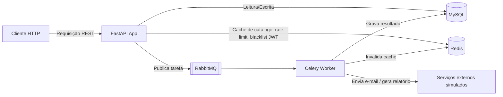

# 01 — Project Charter

## Índice

- [1. Visão Geral](#1-visão-geral)
- [2. Objetivo do Projeto](#2-objetivo-do-projeto)
- [3. Escopo](#3-escopo)
- [4. Fora do Escopo](#4-fora-do-escopo)
- [5. Stakeholders](#5-stakeholders)
- [6. Premissas](#6-premissas)
- [7. Restrições](#7-restrições)
- [8. Riscos](#8-riscos)
- [9. Visão Macro da Arquitetura](#9-visão-macro-da-arquitetura)

---

## 1. Visão Geral

O **Aneleh Commerce API** é uma API RESTful que simula o backend de um e-commerce genérico. Não existe frontend: todo o sistema é consumido via requisições HTTP, documentado através do Swagger/OpenAPI que o próprio FastAPI gera automaticamente.

O projeto existe para servir como **base de estudo e portfólio de backend em Python**, funcionando como um contrato de desenvolvimento entre "cliente" e "desenvolvedor" — mesmo sendo a mesma pessoa nos dois papéis. Essa abordagem é intencional: forçar a existência de um contrato formal (requisitos, critérios de aceite, definition of done) evita que o projeto vire uma sequência de decisões improvisadas.

Este documento é o ponto de partida da documentação. Ele não entra em detalhes técnicos — isso é papel de `03-architecture.md` — mas define o "porquê" que vai justificar todas as decisões técnicas tomadas depois.

---

## 2. Objetivo do Projeto

| Objetivo | Descrição |
|---|---|
| Técnico | Demonstrar domínio de arquitetura backend moderna: organização por módulo de domínio (Package by Feature), autenticação/autorização, cache, mensageria, processamento assíncrono, containerização e CI. |
| Prático | Ter um sistema completo, funcional e testável de ponta a ponta — não apenas fragmentos de código isolados. |
| Pessoal | Servir como material de estudo aprofundado, com cada decisão de arquitetura documentada e justificada, para consulta futura. |

O objetivo **não é** cobrir a maior quantidade possível de funcionalidades de um e-commerce real. É cobrir um subconjunto pequeno e bem executado, que demonstre profundidade em vez de amplitude.

---

## 3. Escopo

O sistema deve cobrir o ciclo completo de um pedido, do cadastro do usuário até o checkout simulado:

- Autenticação e autorização (JWT + RBAC)
- Gestão de usuários e papéis
- Catálogo: categorias e produtos
- Controle de estoque
- Carrinho de compras
- Criação e acompanhamento de pedidos
- Checkout simulado (sem gateway de pagamento real)
- Auditoria de ações relevantes
- Cache de leitura (catálogo)
- Processamento assíncrono para tarefas que não precisam de resposta imediata (e-mail, relatórios, logs, invalidação de cache)

O detalhamento funcional de cada item está em `02-requirements.md`.

---

## 4. Fora do Escopo

Definir o que **não** será feito é tão importante quanto definir o que será. Ficam fora do escopo deste projeto:

- Integração com gateway de pagamento real (Stripe, Mercado Pago, PagSeguro etc.) — o pagamento é sempre simulado.
- Frontend de qualquer tipo (web, mobile, admin panel visual).
- Login social / OAuth2 com provedores externos (Google, Facebook etc.) — a autenticação usa apenas usuário e senha.
- Multi-tenancy (o sistema atende a uma única loja).
- Internacionalização (i18n) e múltiplas moedas.
- Recomendação de produtos, busca com motor de busca dedicado (ex: Elasticsearch) ou qualquer funcionalidade de personalização.
- Deploy em produção com SLA real — o projeto pode, opcionalmente, ter uma demonstração pública, mas sem compromisso de disponibilidade.

Se durante o desenvolvimento surgir a tentação de adicionar algo desta lista, o critério de decisão é: **isso aumenta a profundidade de algo que já está no escopo, ou só aumenta a quantidade de coisas superficiais?** Na dúvida, não entra.

---

## 5. Stakeholders

Como o projeto simula um contrato cliente-desenvolvedor, os stakeholders abaixo são fictícios, mas cumprem um papel real: dar contexto para as decisões de requisito.

| Stakeholder | Papel | Interesse principal |
|---|---|---|
| Cliente fictício | Dono da "loja" | Quer um sistema que funcione de ponta a ponta, com regras de negócio simples mas coerentes. |
| Desenvolvedor (você) | Responsável técnico | Quer aplicar e demonstrar boas práticas de arquitetura backend. |
| Usuário final (persona) | Cliente da loja | Quer navegar pelo catálogo, comprar produtos e acompanhar pedidos. |
| Administrador (persona) | Gestor da loja | Quer gerenciar catálogo, estoque e visualizar relatórios básicos. |

---

## 6. Premissas

- O leitor da documentação conhece Python, mas está construindo conhecimento sólido em arquitetura de software.
- O ambiente de desenvolvimento roda inteiramente via Docker — não há expectativa de instalação manual de MySQL, Redis ou RabbitMQ na máquina local.
- O projeto é desenvolvido sem prazos fixos (ver `06-development-roadmap.md`), mas em fases com critério de conclusão claro.
- As tecnologias listadas como "flexíveis" em `03-architecture.md` podem ser substituídas ao longo do desenvolvimento, desde que a substituição seja justificada.

---

## 7. Restrições

- **Stack fixa:** FastAPI, MySQL, SQLAlchemy 2.0 e Docker não são negociáveis neste projeto.
- **Sem código de produção real de pagamento:** qualquer fluxo de pagamento é mock, por decisão de escopo, não por limitação técnica.
- **Documentação antes de implementação:** nenhuma funcionalidade deve ser implementada antes de estar descrita em `02-requirements.md` e `05-api-design.md`. Isso evita que o código avance sem que as regras de negócio estejam claras.

---

## 8. Riscos

| Risco | Impacto | Mitigação |
|---|---|---|
| Over-engineering (adicionar complexidade que não agrega ao aprendizado) | Atraso no cronograma, perda de foco | Critério de escopo definido na seção 4; revisão do roadmap a cada fase |
| Abandono do projeto por fadiga (comum em projetos pessoais longos) | Projeto incompleto | Fases pequenas e independentes no roadmap, cada uma com "definition of done" clara |
| Inconsistência entre documentação e código (documentação desatualizada) | Perda de valor do projeto como material de estudo | Documentação é atualizada como parte da definition of done de cada fase, não como tarefa à parte |
| Dependência de múltiplos serviços em Docker (MySQL, Redis, RabbitMQ) tornando o ambiente pesado | Ambiente lento ou difícil de subir | `07-deployment.md` define uma estrutura de containers enxuta e um `docker-compose` único, testado desde o início |

---

## 9. Visão Macro da Arquitetura

Em alto nível, o sistema é uma API que expõe recursos REST, protegida por autenticação/autorização, com uma camada de cache para leitura e uma fila de tarefas assíncronas para trabalhos que não bloqueiam a resposta ao cliente.

Essa visão será detalhada módulo por módulo em `03-architecture.md`, incluindo a estrutura de Package by Feature (organização por domínio: `users/`, `products/`, `orders/`, `cart/`, cada um com suas próprias sub-camadas), o fluxo interno de uma requisição e a justificativa de cada tecnologia usada.

---

**Próximo documento:** `02-requirements.md` — detalhamento funcional e não funcional de cada módulo listado na seção 3.
