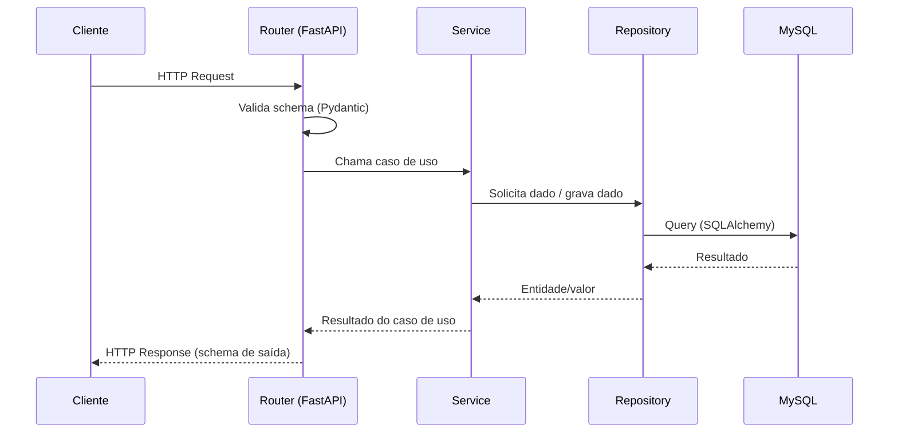
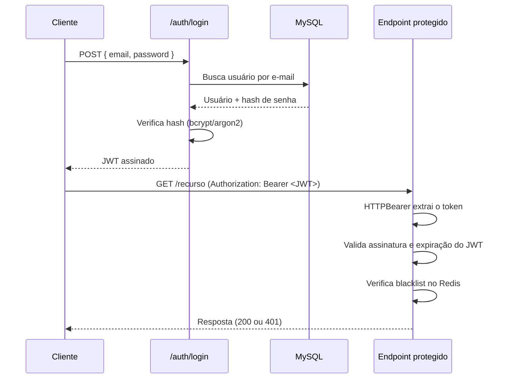
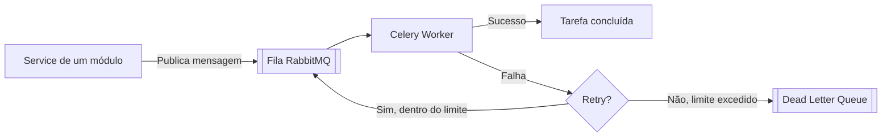
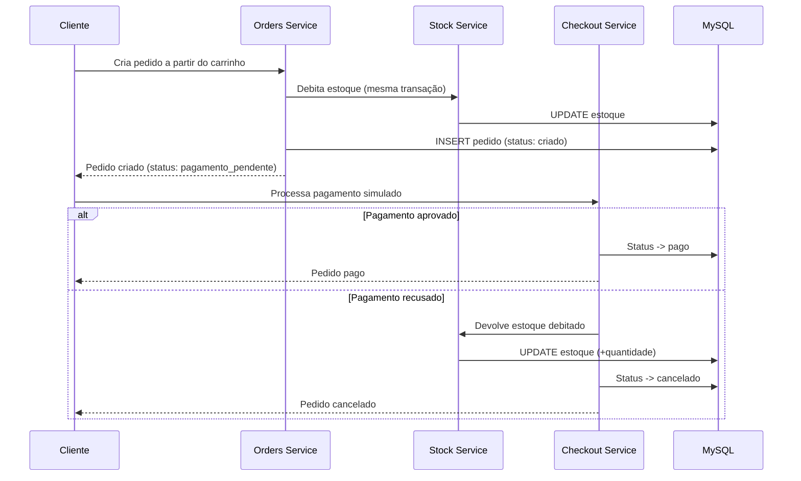
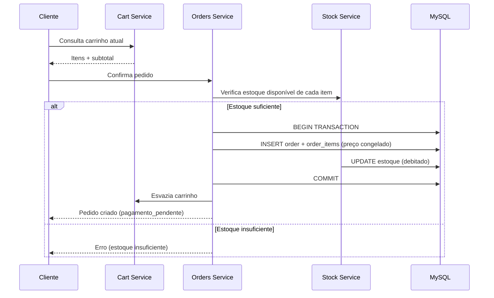

# 03 — Architecture

## Índice

- [1. Visão Geral da Arquitetura](#1-visão-geral-da-arquitetura)
- [2. Package by Feature](#2-package-by-feature)
- [3. Camadas dentro de cada módulo](#3-camadas-dentro-de-cada-módulo)
- [4. Fluxo de uma Requisição](#4-fluxo-de-uma-requisição)
- [5. Autenticação](#5-autenticação)
- [6. Autorização (RBAC)](#6-autorização-rbac)
- [7. Redis](#7-redis)
- [8. RabbitMQ e Celery](#8-rabbitmq-e-celery)
- [9. Fluxo de Checkout](#9-fluxo-de-checkout)
- [10. Sequência de Criação de Pedido](#10-sequência-de-criação-de-pedido)
- [11. Docker](#11-docker)
- [12. CI](#12-ci)
- [13. Estrutura de Pastas](#13-estrutura-de-pastas)

---

## 1. Visão Geral da Arquitetura

A **Aneleh Commerce API** organiza o código por domínio de negócio (**Package by Feature**), não por camada técnica. Dentro de cada domínio, as responsabilidades ainda são separadas em camadas (domínio, aplicação, infraestrutura/interface), mas essa separação acontece *dentro* da pasta do módulo, não como pastas globais que misturam todos os domínios.

Essa escolha substitui o modelo clássico de Clean Architecture (4 anéis: Entities, Use Cases, Interface Adapters, Frameworks & Drivers). O motivo: as regras de negócio deste projeto (debitar estoque, congelar preço no pedido, transicionar status) não são complexas o suficiente para justificar uma Use Case class isolada para cada verbo, com DTOs próprios cruzando cada fronteira. Isso gera cerimônia sem ganho proporcional de clareza — o efeito colateral mais comum é gastar mais tempo desenhando camadas do que implementando regra de negócio.

Mesmo assim, o princípio central da Clean Architecture é mantido: regra de negócio fica isolada na camada de `service`, sem se misturar com o código do FastAPI ou do SQLAlchemy

---

## 2. Package by Feature

A estrutura é:

```
app/
├── users/
├── products/
├── categories/
├── stock/
├── cart/
├── orders/
├── checkout/
└── audit/
```

Esse conceito também é conhecido como **Screaming Architecture** (termo do próprio Robert C. Martin): a estrutura de pastas deve "gritar" o que o sistema faz — é um e-commerce, tem produtos, pedidos, carrinho — e não gritar qual framework foi usado.

---

## 3. Camadas dentro de cada módulo

Cada módulo de domínio segue a mesma sub-estrutura interna:

```
orders/
├── router.py       # Interface: define as rotas FastAPI, valida entrada/saída (schemas)
├── schemas.py       # Contratos de entrada/saída (Pydantic)
├── service.py       # Aplicação: regra de negócio e orquestração do caso de uso
├── models.py         # Domínio: entidade SQLAlchemy (Order, OrderItem)
└── repository.py    # Infraestrutura: acesso a dado, isolado atrás de uma porta
```

| Camada | Responsabilidade | Não deve conhecer |
|---|---|---|
| Router (interface) | Receber requisição HTTP, validar formato, chamar o service, formatar resposta | Regra de negócio, SQL |
| Service (aplicação) | Regra de negócio, orquestração entre módulos (ex: debitar estoque ao criar pedido) | Detalhes do FastAPI, SQL cru |
| Repository (infraestrutura) | Conversar com o banco (SQLAlchemy) ou com serviços externos (Redis, RabbitMQ) diretamente | Regra de negócio |

O `service` é o único lugar onde regra de negócio deveria existir. Isso facilita testar regra de negócio sem precisar subir um banco de dados de verdade (usando um repository fake que implementa a mesma porta).

---

## 4. Fluxo de uma Requisição



---

## 5. Autenticação

**Decisão:** JWT como formato de token, validado via `HTTPBearer` — não `OAuth2PasswordBearer`.

**Por que não `OAuth2PasswordBearer`:** ele obriga o endpoint de login a aceitar `application/x-www-form-urlencoded` com um campo fixo chamado `username`, mesmo que a autenticação real seja por e-mail. Isso é um contrato emprestado do fluxo OAuth2 (que nem está sendo implementado de verdade — não há authorization server nem terceiros envolvidos) e não faz sentido pra esta API.

**Decisão adotada:** `HTTPBearer` apenas extrai o header `Authorization: Bearer <token>` e delega a validação do JWT para a lógica da aplicação. O endpoint de login recebe um JSON comum (`{ "email": ..., "password": ... }`) e devolve o token — sem nenhuma semântica de OAuth2 embutida. O botão "Authorize" do Swagger continua funcionando normalmente com `HTTPBearer`.



---

## 6. Autorização (RBAC)

Papéis: `admin`, `customer` (papel opcional `staff`, se necessário no futuro).

A checagem de papel acontece via dependency do FastAPI, aplicada por endpoint:

```python
@router.delete("/products/{id}", dependencies=[Depends(require_role("admin"))])
def delete_product(id: int): ...
```

**Decisão de design:** o papel do usuário é revalidado no banco a cada requisição (não confia apenas no papel embutido no JWT), para que uma mudança de papel feita por um `admin` tenha efeito imediato, sem exigir que o usuário afetado faça login novamente. O custo extra de uma consulta ao banco por requisição é aceitável dado o volume esperado do projeto.

---

## 7. Redis

| Uso | Justificativa |
|---|---|
| Cache de listagem de produtos | Listagem de catálogo é lida com muito mais frequência do que é escrita — candidata natural a cache. |
| Cache de detalhe do produto | Mesmo raciocínio, com invalidação granular (só o produto alterado, não a listagem inteira). |
| Rate limiting | Protege endpoints públicos (listagem, login) de abuso, usando contadores com TTL no Redis. |
| Blacklist de JWT | Permite invalidar um token antes da expiração natural sem manter estado de sessão no banco. |

Todos esses usos acessam o client do Redis diretamente dentro do `repository` ou `service` do módulo correspondente.

---

## 8. RabbitMQ e Celery

**Decisão:** manter RabbitMQ como broker do Celery, em vez de usar o próprio Redis como broker.

| Opção | Prós | Contras |
|---|---|---|
| Redis como broker | Um serviço a menos no `docker-compose`; mais simples de operar | Não demonstra conhecimento de um broker dedicado (filas, exchanges, dead-letter); Redis como broker tem garantias mais fracas de entrega |
| RabbitMQ como broker (escolhido) | Demonstra domínio de um message broker de verdade (AMQP); suporta dead-letter queues e retry nativamente | Mais um serviço para subir e operar em `docker-compose` |

Para um projeto de portfólio, o ganho de demonstrar conhecimento de AMQP/RabbitMQ compensa o custo de mais um container.



Tarefas assíncronas do projeto: envio de e-mail, gravação de auditoria, geração de relatórios (vendas por período, produtos mais vendidos), invalidação de cache custosa.

---

## 9. Fluxo de Checkout

**Decisão registrada:** se o pagamento simulado é **recusado**, o estoque debitado na criação do pedido é **devolvido**. O estoque só fica definitivamente comprometido quando o pagamento é aprovado.



---

## 10. Sequência de Criação de Pedido



---

## 11. Docker

Cada serviço roda em seu próprio container, orquestrado por um único `docker-compose.yml`: API (FastAPI), MySQL, Redis, RabbitMQ, Celery Worker. Detalhamento completo (variáveis de ambiente, healthchecks, volumes) fica em `07-deployment.md` — este documento cobre apenas o papel de cada container na arquitetura.

---

## 12. CI

GitHub Actions executa, a cada push: lint (Flake8), formatação (Black, em modo checagem) e testes (Pytest). O pipeline completo (etapas, cache de dependências, matriz de versão) é detalhado em `07-deployment.md`.

---

## 13. Estrutura de Pastas

```
app/
├── main.py
├── core/              # configuração, JWT, dependências compartilhadas
├── users/
├── auth/
├── categories/
├── products/
├── stock/
├── cart/
├── orders/
├── checkout/
└── audit/
tests/
├── users/
├── products/
├── orders/
└── ...
```

Cada módulo em `tests/` espelha o módulo correspondente em `app/`, mantendo a mesma lógica de Package by Feature também na suíte de testes.

---

**Próximo documento:** `04-database.md` — modelagem de entidades, relacionamentos e o diagrama ER completo.
