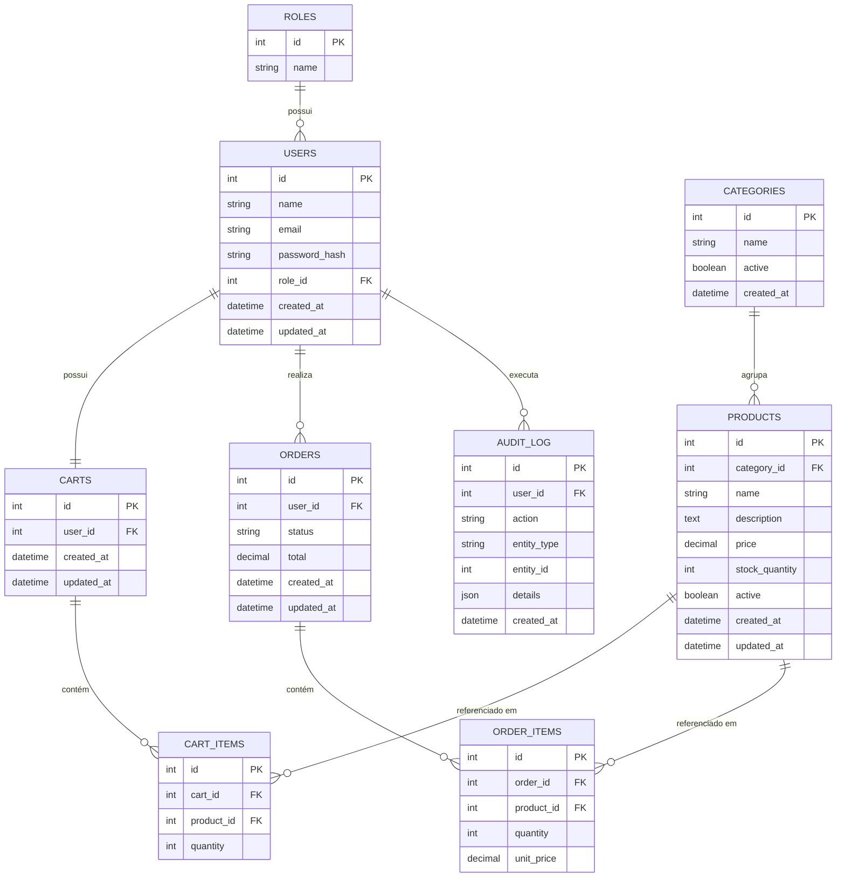

# 04 — Database

## Índice

- [1. Visão Geral da Modelagem](#1-visão-geral-da-modelagem)
- [2. Entidades](#2-entidades)
- [3. Relacionamentos](#3-relacionamentos)
- [4. Índices](#4-índices)
- [5. Constraints e Regras de Integridade](#5-constraints-e-regras-de-integridade)
- [6. Diagrama Entidade-Relacionamento](#6-diagrama-entidade-relacionamento)

---

## 1. Visão Geral da Modelagem

A modelagem segue a mesma organização por domínio usada no código (`users`, `products`, `orders`...), com uma tabela (ou pequeno grupo de tabelas) por módulo. Duas simplificações intencionais, coerentes com o objetivo de manter o projeto enxuto:

- **Papel do usuário é um campo único (`role_id`), não uma tabela associativa many-to-many.** RBAC aqui não precisa de múltiplos papéis simultâneos por usuário — `admin`, `customer` (e `staff`, se vier a existir) são mutuamente exclusivos neste projeto. Se essa premissa mudar no futuro, a migração para many-to-many é direta, mas não há motivo para pagar essa complexidade agora.
- **Estoque é uma coluna do produto (`stock_quantity`), não uma tabela separada.** Um histórico de movimentação de estoque já existe através do `audit_log` (toda alteração de estoque gera uma entrada de auditoria, RF-STOCK-01) — criar uma tabela extra só para "estoque atual" duplicaria informação sem necessidade.

---

## 2. Entidades

### `roles`

| Coluna | Tipo | Observação |
|---|---|---|
| id | INT, PK | |
| name | VARCHAR(30) | `admin`, `customer` (ou `staff`) |

### `users`

| Coluna | Tipo | Observação |
|---|---|---|
| id | INT, PK | |
| name | VARCHAR(120) | |
| email | VARCHAR(180) | único |
| password_hash | VARCHAR(255) | bcrypt/argon2, nunca exposto via API |
| role_id | INT, FK → roles.id | papel único do usuário |
| created_at | DATETIME | |
| updated_at | DATETIME | |

### `categories`

| Coluna | Tipo | Observação |
|---|---|---|
| id | INT, PK | |
| name | VARCHAR(100) | único |
| active | BOOLEAN | soft delete (RF-CATALOG-01) |
| created_at | DATETIME | |

### `products`

| Coluna | Tipo | Observação |
|---|---|---|
| id | INT, PK | |
| category_id | INT, FK → categories.id | |
| name | VARCHAR(150) | |
| description | TEXT | |
| price | DECIMAL(10,2) | > 0 |
| stock_quantity | INT | ≥ 0 |
| active | BOOLEAN | soft delete |
| created_at | DATETIME | |
| updated_at | DATETIME | |

### `carts`

| Coluna | Tipo | Observação |
|---|---|---|
| id | INT, PK | |
| user_id | INT, FK → users.id | único — um carrinho por usuário |
| created_at | DATETIME | |
| updated_at | DATETIME | |

### `cart_items`

| Coluna | Tipo | Observação |
|---|---|---|
| id | INT, PK | |
| cart_id | INT, FK → carts.id | |
| product_id | INT, FK → products.id | |
| quantity | INT | > 0 |

### `orders`

| Coluna | Tipo | Observação |
|---|---|---|
| id | INT, PK | |
| user_id | INT, FK → users.id | |
| status | ENUM | `criado`, `pagamento_pendente`, `pago`, `enviado`, `concluído`, `cancelado` |
| total | DECIMAL(10,2) | soma dos `order_items` no momento da criação |
| created_at | DATETIME | |
| updated_at | DATETIME | |

### `order_items`

| Coluna | Tipo | Observação |
|---|---|---|
| id | INT, PK | |
| order_id | INT, FK → orders.id | |
| product_id | INT, FK → products.id | |
| quantity | INT | > 0 |
| unit_price | DECIMAL(10,2) | preço **congelado** no momento da criação do pedido (RF-ORDERS-01) |

### `audit_log`

| Coluna | Tipo | Observação |
|---|---|---|
| id | INT, PK | |
| user_id | INT, FK → users.id, nullable | quem executou a ação |
| action | VARCHAR(100) | ex: `stock_adjustment`, `role_change`, `order_status_change` |
| entity_type | VARCHAR(50) | ex: `product`, `order`, `user` |
| entity_id | INT | id da entidade afetada |
| details | JSON | dados relevantes da mudança (ex: valor anterior/novo) |
| created_at | DATETIME | |

---

## 3. Relacionamentos

| Relação | Tipo | Observação |
|---|---|---|
| `roles` → `users` | 1:N | um papel para muitos usuários |
| `users` → `carts` | 1:1 | um carrinho por usuário |
| `carts` → `cart_items` | 1:N | |
| `products` → `cart_items` | 1:N | |
| `categories` → `products` | 1:N | |
| `users` → `orders` | 1:N | |
| `orders` → `order_items` | 1:N | |
| `products` → `order_items` | 1:N | |
| `users` → `audit_log` | 1:N (opcional) | ação pode não ter usuário associado (ex: job automático) |

---

## 4. Índices

| Tabela | Índice | Motivo |
|---|---|---|
| `users` | único em `email` | login e cadastro (RF-AUTH-01/02) |
| `categories` | único em `name` | evita categoria duplicada (RF-CATALOG-01) |
| `products` | índice em `category_id` | listagem filtrada por categoria (RF-CATALOG-03) |
| `products` | índice em `active` | listagem exclui inativos por padrão |
| `cart_items` | único composto em (`cart_id`, `product_id`) | impede linha duplicada do mesmo produto no carrinho (RF-CART-01) |
| `orders` | índice em `user_id` | consulta "meus pedidos" |
| `orders` | índice em `status` | relatórios e filtros administrativos |
| `audit_log` | índice composto em (`entity_type`, `entity_id`) | consulta de histórico de uma entidade específica |

---

## 5. Constraints e Regras de Integridade

- `products.price > 0` — check constraint (RF-CATALOG-02).
- `products.stock_quantity >= 0` — check constraint (RF-STOCK-01).
- `cart_items.quantity > 0` e `order_items.quantity > 0` — check constraint.
- `cart_items (cart_id, product_id)` — unique constraint (RF-CART-01: adicionar produto já existente soma quantidade, nunca duplica linha).
- `orders.status` — validado na camada de aplicação (`service`), não apenas no banco, já que a transição entre estados segue uma máquina de estados (ver `03-architecture.md`, seção 10) que uma constraint de banco não expressa bem sozinha.
- Exclusão de `categories` com produtos vinculados é bloqueada na aplicação (RF-CATALOG-01) — a tabela permite `ON DELETE RESTRICT` na FK como segunda camada de proteção.
- `order_items.unit_price` nunca é recalculado a partir de `products.price` após a criação do pedido — é responsabilidade da aplicação congelar o valor no INSERT, não do banco.

---

## 6. Diagrama Entidade-Relacionamento

---

**Próximo documento:** `05-api-design.md` — contrato completo de todos os endpoints, incluindo autenticação necessária, permissões por papel, paginação e formato de erro.
